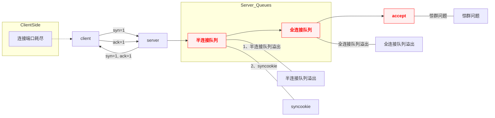
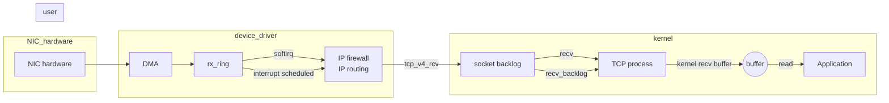

总结一下常见的内核参数调优

## 1. 常见参数列表

| 参数 | 所属子系统 | 取值范围 | 调优示例 | 功能说明 | 优化场景及影响 |
|------------------------------|-------------------|-----------|--------------------|-------------------------------------|--------------------------|
| fs.file-max| 文件系统 | 取决于系统内存，通常为数十万至数百万 | 1024000 | 系统级最大文件描述符数。| 适用于高并发服务器，防止文件句柄耗尽导致服务不可用。 |
| fs.inotify.max_user_watches | 文件系统 | 通常为8192 ~ 数百万| 8192000 | 单用户最大inotify监视数。 | 适合文件监控密集的应用，如IDE、文件同步工具，防止监视资源不足。|
| fs.inotify.max_user_instances| 文件系统 | 通常为128 ~ 数百万 | 8192000 | 单用户最大inotify实例数。 | 配合max_user_watches使用，防止应用启动失败。|
| net.core.somaxconn | 网络 | 128 ~ 65535 | 65535 | 每个socket监听等待应用程序accept队列最大长度。| 适用于高并发网络服务，提升连接排队能力，减少拒绝服务。|
| net.core.netdev_max_backlog | 网络 | 128 ~ 65535 | 10000 | 进入网卡还没被内核协议栈处理的报文最大长度。 | 适用于高并发网络服务，防止接收队列溢出。 |
| net.ipv4.tcp_max_syn_backlog | 网络 | 128 ~ n | 40960 | 内核保持的未被 ACK 的 SYN 包最大队列长度。 | 适用于高并发网络服务，防止半连接队列溢出。 |
| net.ipv4.tcp_max_tw_buckets | 网络 | 1024 ~ 65535 | 180000 | TIME-WAIT套接字最大数量。 | 适用于高并发网络服务，防止TIME-WAIT套接字耗尽。 |
| net.ipv4.tcp_tw_reuse| 网络 | 0 或 1 | 1| 允许重用TIME-WAIT状态的套接字。 | 适合高连接频率客户端如 nginx 反向代理等，减少TIME-WAIT端口耗尽。|
| net.ipv4.tcp_fin_timeout | 网络 | 1 ~ 60秒 | 15| TCP连接FIN-WAIT-2状态超时时间。| 减少关闭连接等待时间，释放资源，适合连接频繁的服务器。 |
| net.ipv4.ip_local_port_range | 网络 | 1024 ~ 65535 | 15000 60999| 本地端口分配范围。 | 扩大范围可支持更多短连接，适合高并发客户端或代理服务器。 |
| net.ipv4.tcp_keepalive_time | 网络 | 1 ~ 7200秒 | 30| 最大闲置时间 | 从最后一个 data packet之后多长时间开始发送探测包，单位秒,用于检测死连接，适合长连接服务，防止资源浪费。容器内此参数必须比宿主机小，否则可能出现 write:broken pipe报错 |
| net.ipv4.tcp_keepalive_intvl | 网络 | 1 ~ 300秒 | 30 | 探测间隔时间 | 在此期间连接上传输了任何内容都不影响探测的发送，单位是秒 |
| net.ipv4.tcp_keepalive_probes | 网络 | 1 ~ 10 | 3 | 最大失败次数 | 超过此值后将通知应用层连接失效 |
| net.ipv4.ip_forward | 网络 | 0 或 1| 1| 是否启用IP转发。 | 路由器或网关必开，普通主机一般关闭。 |
| net.ipv4.tcp_timestamps | 网络 | 0 或 1| 1| 启用TCP时间戳。 | 提高网络性能和防止序列号回绕，但可能泄露时间信息。 |
| net.ipv4.tcp_tw_recycle | 网络 | 0 或 1| 0| 快速回收TIME-WAIT套接字。 | 一般禁用，因导致NAT环境连接问题。|
| net.ipv4.tcp_syncookies | 网络 | 0 或 1| 1| 启用SYN Cookies。 | 提高TCP连接建立速度，适合高并发服务器。 |
| net.ipv4.tcp_mem | 网络 | 3个整数，以空格分隔 | 3043587 4058117 6087174 | TCP内存分配参数。 | 调整参数可优化TCP连接建立速度，适合高并发服务器。 |
| net.ipv4.tcp_rmem | 网络 | 3个整数，以空格分隔 | 4096 87380 33554432 | TCP接收缓冲区参数。 | 调整参数可优化TCP连接建立速度，适合高并发服务器。 |
| net.ipv4.tcp_wmem | 网络 | 3个整数，以空格分隔 | 4096 65536 33554432 | TCP发送缓冲区参数。 | 调整参数可优化TCP连接建立速度，适合高并发服务器。 |
| net.core.rmem_max | 网络 | 1024 ~ 16777216 | 16777216 | 接收缓冲区最大长度。 | 适用于高并发网络服务，防止接收缓冲区溢出。 |
| net.core.wmem_max | 网络 | 1024 ~ 16777216 | 16777216 | 发送缓冲区最大长度。 | 适用于高并发网络服务，防止发送缓冲区溢出。 |
| net.core.rmem_default | 网络 | 1024 ~ 16777216 | 1048576 | 接收缓冲区默认长度。 | 适用于高并发网络服务，防止接收缓冲区溢出。 |
| net.core.wmem_default | 网络 | 1024 ~ 16777216 | 524288 | 发送缓冲区4096 65536 33554432 默认长度。 | 适用于高并发网络服务，防止发送缓冲区溢出。 |
| net.ipv4.tcp_congestion_control | 网络 | 算法名称，如cubic、bbr等 | cubic | TCP拥塞控制算法。 | 适用于高并发网络服务，优化网络性能。BBR 算法，适用于 4.9 以上的所有内核，建议使用 4.19 以上内核 |
| vm.swappiness | 虚拟内存管理 | 0 ~ 100 | 0| swap使用倾向，0尽量不使用swap，100积极使用。 | 数据库等内存敏感应用常设为0以减少IO延迟。 |
| vm.overcommit_memory| 虚拟内存管理 | 0、1、2 | 1| 内存分配策略：0启发式，1总是允许，2严格限制。 | 1适合内存充足环境，2适合内存紧张防止OOM。|
| vm.dirty_background_ratio | 虚拟内存管理 | 0 ~ 100 | 5 | 脏页比例达到该值时触发后台写回。 | 适用于数据库等需要频繁写入的应用，防止写回过多导致性能下降。 |
| vm.max_map_count| 虚拟内存管理 | 通常为65530 ~ 数百万，具体上限依赖内存 | 1024000 | 设置单个进程最大内存映射区域数量。 | 适用于数据库（如Elasticsearch）等需要大量内存映射的应用，防止映射不足导致失败。 |
| kernel.pid_max | 内核调度 | 32768 ~ 4194303| 4194303 | 最大进程ID。 | 适合容器或高并发进程场景，避免PID耗尽。 |
| kernel.randomize_va_space| 内存管理/安全 | 0、1、2 | 2| 地址空间布局随机化等级，0关闭，2完全启用。 | 增强安全性，防止攻击。 |

半/全连接
半全连接队列是 server 端影响连接建立最常见两个限制，概念如下：

1. 半连接队列：存放处于 TCP_NEW_SYN_RECV 状态的 sock，此时三次握手尚未完成，内核需要一个队列暂存。通常来说，这个参数和 /proc/sys/net/ipv4/tcp_max_syn_backlog 有关，修改后可立即生效；
2. 全连接队列：存放完成三次握手，但进程尚未 accept 的队列的 sock。这个参数通常由两个部分确定，分别是 listen 函数的第二个参数和 /proc/sys/net/core/somaxconn 共同决定，小的为准，修改后需重启进程才能生效。

两者的关系：半连接队列受全连接队列影响的，道理也很简单，全连接都已经满了，也没必要再处理半连接了。在排除全连接队列影响下，两者的关系不同内核也一直在调整，不考虑 syncookie 情况下当前的 4.14/4.19 syn-sock 入队的条件如下:

- 全连接队列未满；
- tcp_max_syn_backlog - 半连接队列深度  >   tcp_max_syn_backlog*1/4；
- tcp_max_syn_backlog - 半连接队列深度  <  1/4 且client地址不久前成功连接过。

网络收包流程图

